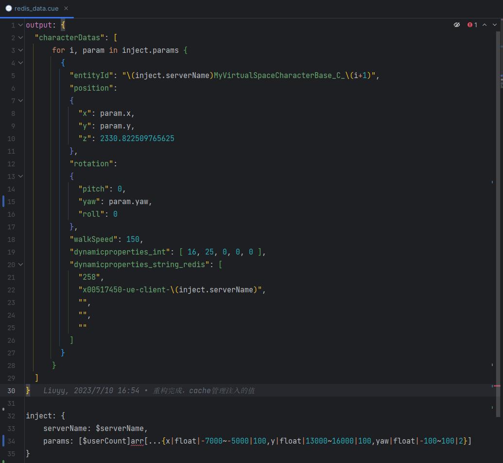
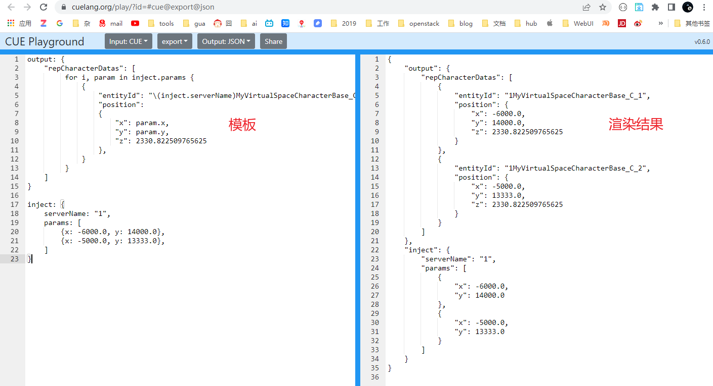

## 用途
本工具用于向 Redis 插入一些 mock 数据，以便于测试。

## 使用方法
> 如果代码没有更新，可直接运行 `build` 目录下的可执行文件 `mock-ue-server.exe`;
> 
> 如果代码有更新，可执行 `build.bat` 重新编译。

通过 `--help（-h）` 查看帮助信息：

```shell
PS C:\Users\Administrator\OneDrive\develop\GolandProjects\mock-ue-server\build> .\mock-ue-server.exe -h
Long Description 

Usage:
  mock-ue-server [flags]

Flags:
  -d, --db string             db addr, host:port (default "127.0.0.1:6379")
  -h, --help                  help for mock-ue-server
  -i, --interval int          interval for refresh data, unit ms (default 100)
  -v, --is-print-debug-log    is print debug log
  -s, --server-names string   server names, split by comma, required
  -t, --tpl-file string       redis data template file path, required
  -u, --user-count int        user count for each server (default 100)
```

以下是我们项目中的使用示例：

mock 950 client，其中有 19 个 ue-server，每个 ue-server 有 50 个用户
```shell
./mock-ue-server -s "2,3,4,5,6,7,8,9,10,11,12,13,14,15,16,17,18,19,20" --user-count 50 -t ./redis_data.cue
```
指定 redis server
```shell
./mock-ue-server -d 10.12.3.74:6379 -s "2,3,4,5,6,7,8,9,10,11,12,13,14,15,16,17,18,19,20" --user-count 50 -t ./redis_data.cue
```


## 模板文件说明
模板文件采用 [CUE](https://cuelang.org/) 语法

`output`部分为最终写入 redis 的数据；

`inject`部分为注入到 `output` 中的数据。可以看到这块语法检查有报错。
这是因为 CUE 本身不支持随机数据生成，这里是我们自定义的一个数据格式，我们工具会做如下处理：
1. 我们工具首先会读取`inject`中的内容；
2. 根据我们自定义的数据格式，生成随机数据；
3. 用上一步生成的随机数据，替换 `inject` 中的内容，以生成标准的`CUE`模板；
4. 渲染 `CUE` 模板，得到最终的数据，写入 redis。 

### 自定义数据格式
- `$serverName` 不用修改，工具在渲染 server 数据时，会自动将其替换为我们输入的 serverName；
- `$userCount` 不用修改，这里只是方便我们直观理解，这里我们会生成**对象数组**，数组的长度与 `$userCount` 相同；
   关于组中每个对象的定义格式为：{[属性名]|[属性值的类型]}|[属性值的范围]|[每个数据刷新周期的最大变化量]}

例如模板定义如下：
```
output: {
    "repCharacterDatas": [
         for i, param in inject.params {
             {
                 "entityId": "\(inject.serverName)MyVirtualSpaceCharacterBase_C_\(i+1)",
                 "position":
                 {
                     "x": param.x,
                     "y": param.y,
                     "z": 2330.822509765625
                 },
             }
         }
    ]
}

inject: {
    serverName: $serverName,
    params: [$userCount]arr[...{x|float|-7000~-5000|100,y|float|13000~16000|100}]
}
```
如果我们输入的 单个服务器接入的玩家数为 `2`，则最终生成的`CUE`模板为（以serverName为`1`为例）：
```cue
output: {
    "repCharacterDatas": [
         for i, param in inject.params {
             {
                 "entityId": "\(inject.serverName)MyVirtualSpaceCharacterBase_C_\(i+1)",
                 "position":
                 {
                     "x": param.x,
                     "y": param.y,
                     "z": 2330.822509765625
                 },
             }
         }
    ]
}

inject: {
    serverName: "1",
    params: [
        {x: -6000.0, y: 14000.0},
        {x: -5000.0, y: 13333.0},   
    ]
}
```
在 https://cuelang.org/play/?id=#cue@export@json 可以看到该 CUE 模板的渲染结果：
